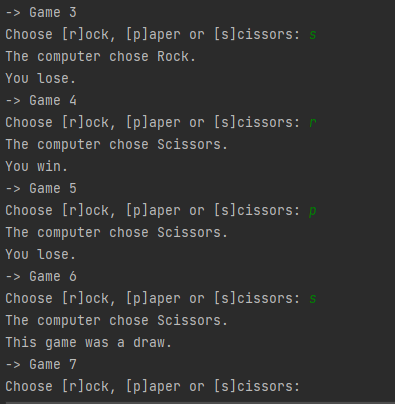

# "Rock-Paper-Scissors" Game
</img>

A simple console-based Java two-player game.
Тhe game is divided into seasons, each consisting of 10 games.
For each game, the player and the computer chooses between Rock, Scissors and Paper.
* The rule are as fallows: 
  - Rock beats Scissors 
  - Scissors beats Paper 
  - Paper beats Rock
  
*Also, the computer has an extra special item. Play to find out.*
  
*Screenshot:*
 
</img>

## Live Demo

You can try the game directly in your browser here:
 
 

 
 
• [Source code](https://github.com/aChaushev/RockPaperScissorsGameBy_aChaushev/blob/main/RockPaperScissors.java)
• ***by aChaushev***

